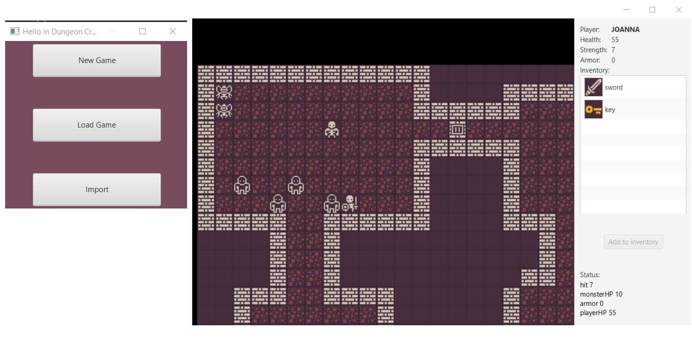
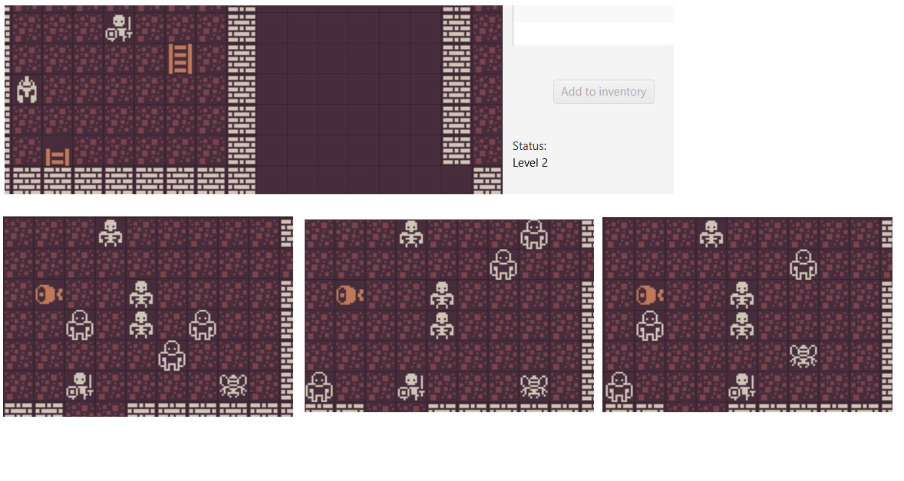

# Dungeon Crawl (sprint 1,2)

_Project developed in January 2021. (Codecool course)_ 

_Developers: Joanna Rzeszótko-Doniec, Jakub Zieliński, Piotr Wójcik, Dominik Wątor_

_Key words: roguelike game, java, javaFx, load from/ save in database or file (Dao interface), levels, fight, randomly moving monsters, inventory_

## Project assumptions

- Game loaded from a file or from a database  (option to save in database or to a file)
- Player can explore different boards, fight with different enemies, collects items
- All items and most of creatures are located randomly 
- There is a status line with current information for user (e.g. about fight status, level)
- Monsters are moving randomly
